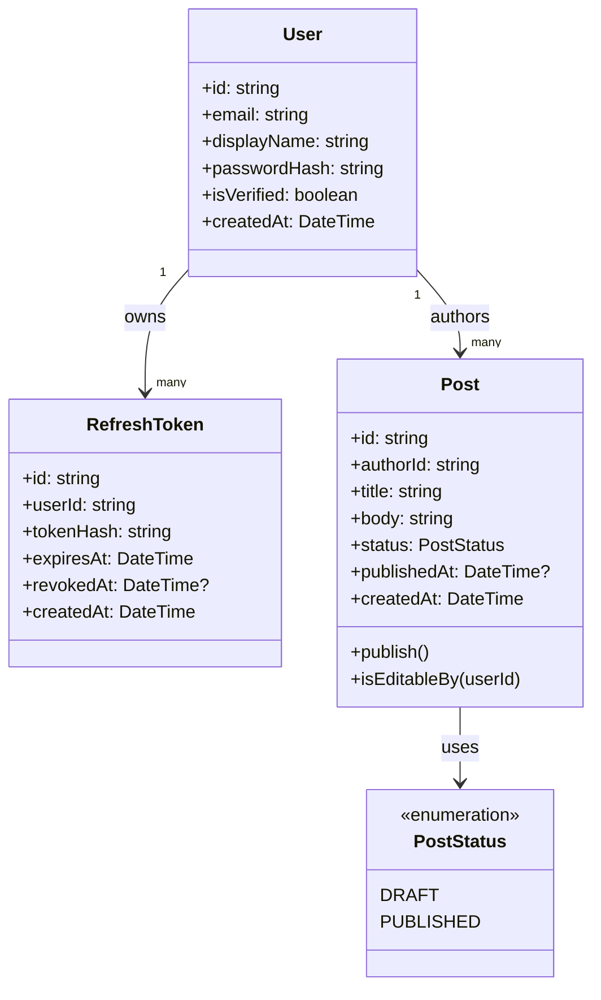

# Inkwell Design Classes - v1

This document turns the analysis classes into implementation-oriented design classes for US-01, US-02, and US-04. Publish Post's editor and component-level design remains deferred to the later workshop specified by the course plan.

## User (entity)

- `id: string`
- `email: string` (unique)
- `displayName: string`
- `passwordHash: string`
- `isVerified: boolean`
- `createdAt: DateTime`

Responsibilities:

- Represent account data.
- Provide the identity used by posts and refresh tokens.

The `User` class does not hash or verify passwords. `AuthService` owns those operations so the user entity remains independent of the password-hashing library.

## RefreshToken (persistence entity)

- `id: string`
- `userId: string`
- `tokenHash: string`
- `expiresAt: DateTime`
- `revokedAt: DateTime | null`
- `createdAt: DateTime`

A raw refresh token is returned only through the authentication response. The server stores a hash and uses it to validate, rotate, and revoke refresh tokens.

## Post (entity)

- `id: string`
- `authorId: string`
- `title: string`
- `body: string`
- `status: PostStatus`
- `publishedAt: DateTime | null`
- `createdAt: DateTime`

Operations:

- `publish(): void`
- `isEditableBy(userId: string): boolean`

`Post.status` uses the fixed values `DRAFT` and `PUBLISHED`, not free text. This catches spelling errors early. Adding a future status such as `ARCHIVED` will require an intentional schema change.

Every post has exactly one author, so `authorId` is stored directly on `Post`. A join table is unnecessary unless multi-author posts become a requirement.

## PostStatus (value set)

```text
DRAFT
PUBLISHED
```

The database representation must use an enum or equivalent fixed constraint. The application must not accept arbitrary status strings.

## Planned Comment (US-05 review boundary)

Comments are not implemented in this Workshop 4 increment. Before implementing US-05, add a design class with at least:

- `id: string`
- `postId: string`
- `authorId: string`
- `body: string`
- `createdAt: DateTime`

The comment design must confirm whether comments are allowed only on published posts and must match the contract in `api-contract.md`. This review is required because comments introduce a new behavior around the Post state model.

## Relationships



## Design decisions

- `User.email` is unique at the database level. Application checks provide a useful error, while the constraint protects against races.
- `AuthService`, not `User`, owns password hashing and verification.
- `Post.authorId` is required because each post has one author.
- `Post.status` is a fixed enum with only `DRAFT` and `PUBLISHED` in the current design.
- Persistence entities are not returned directly from routes. Services map them to public response objects so password hashes, token hashes, and internal fields remain private.
