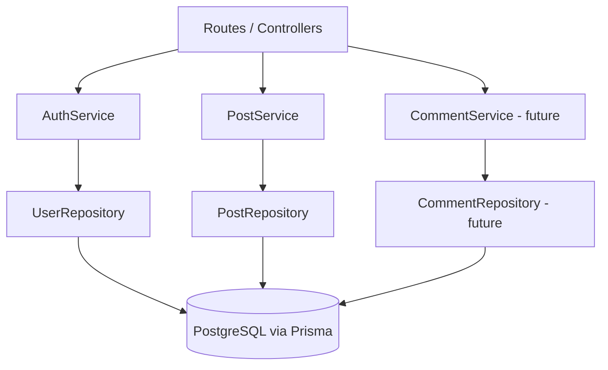

# Inkwell Server Module Structure - v1

The server is divided by responsibility. Each module communicates through simple data objects and public method contracts rather than accessing another module's internals.

## Routes/controllers

Routes are boundary modules. They:

- Receive and validate the HTTP-level request shape.
- Call the appropriate service.
- Translate service results into the documented HTTP status and response JSON.
- Translate known service errors into the common `{ error: { code, message } }` format.
- Never query Prisma or PostgreSQL directly.

Planned route groups:

- `authRoutes`: registration and login endpoints.
- `postRoutes`: public feed and later post operations.
- `commentRoutes` or a nested post route: comment creation from the API contract.

## Services

### AuthService

`AuthService` is a pure fabrication/coordinator for authentication behavior. It:

- Validates authentication-specific rules.
- Hashes passwords during registration.
- Verifies passwords during login.
- Issues access tokens and refresh tokens.
- Coordinates refresh-token persistence and prevents partial authentication when refresh-token issuance fails.
- Starts verification-message delivery and reports delivery failure without marking an account verified.

It does not expose password hashes or token hashes to routes or the client.

### PostService

`PostService` coordinates post behavior. It:

- Retrieves the public feed through `PostRepository`.
- Applies the published-only, newest-first, fixed-page-size feed rules.
- Enforces post ownership for author operations.
- Applies draft-to-published transition rules.
- Keeps the detailed editor workflow deferred to the later Publish Post design increment.

### CommentService (future US-05)

`CommentService` will coordinate comment creation after the `Comment` class and post-state behavior are reviewed. It will:

- Require an authenticated author.
- Validate comment text.
- Confirm the target post is available for comments.
- Call `CommentRepository` for persistence.

## Repositories

Repositories are the only modules that communicate directly with Prisma/PostgreSQL.

### UserRepository

Owns user persistence operations such as:

- Find by email.
- Create a user with a password hash and verification state.
- Update verification state.
- Persist and retrieve refresh-token hashes through the selected persistence boundary.

### PostRepository

Owns post persistence operations such as:

- Retrieve published posts in deterministic descending publish order.
- Retrieve a post by ID.
- Create and update posts for later Publish Post work.

### CommentRepository (future US-05)

Will create and retrieve comments and their post/author relationships. It must not be called directly by a route.

## Dependency flow



The direction is:

```text
Routes -> Services -> Repositories -> PostgreSQL
```

No route imports Prisma. No repository applies HTTP response behavior. No service depends on a repository's database client details.

## Public data boundaries

Services map persistence records to public response objects before returning data to routes. In particular, the following must remain private:

- `User.passwordHash`
- `RefreshToken.tokenHash`
- Database-specific token and migration details
- Internal fields not listed in `docs/design/api-contract.md`

This boundary lets the database schema and implementation libraries change without forcing client changes.
