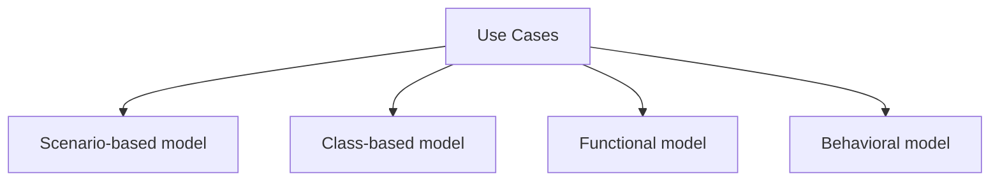
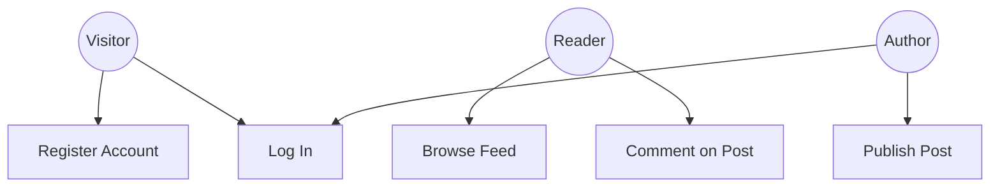
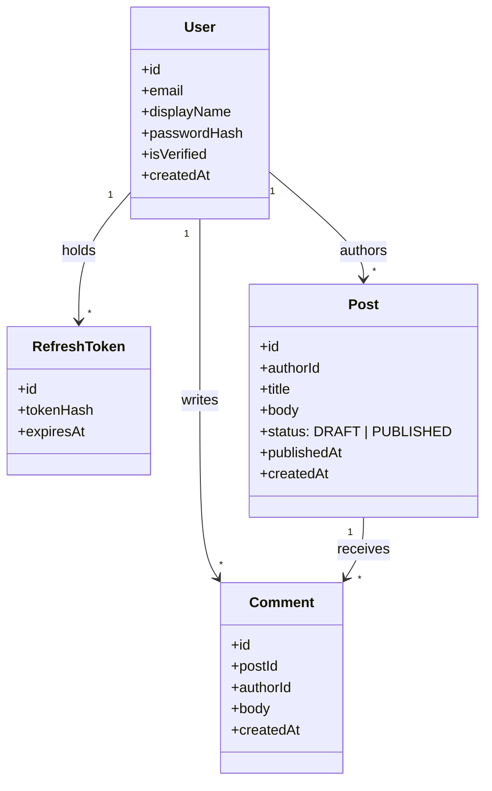
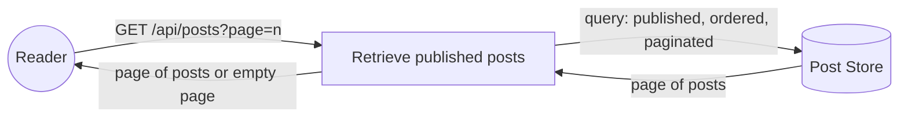
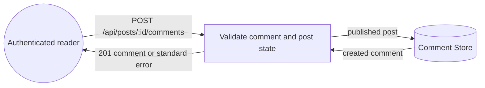
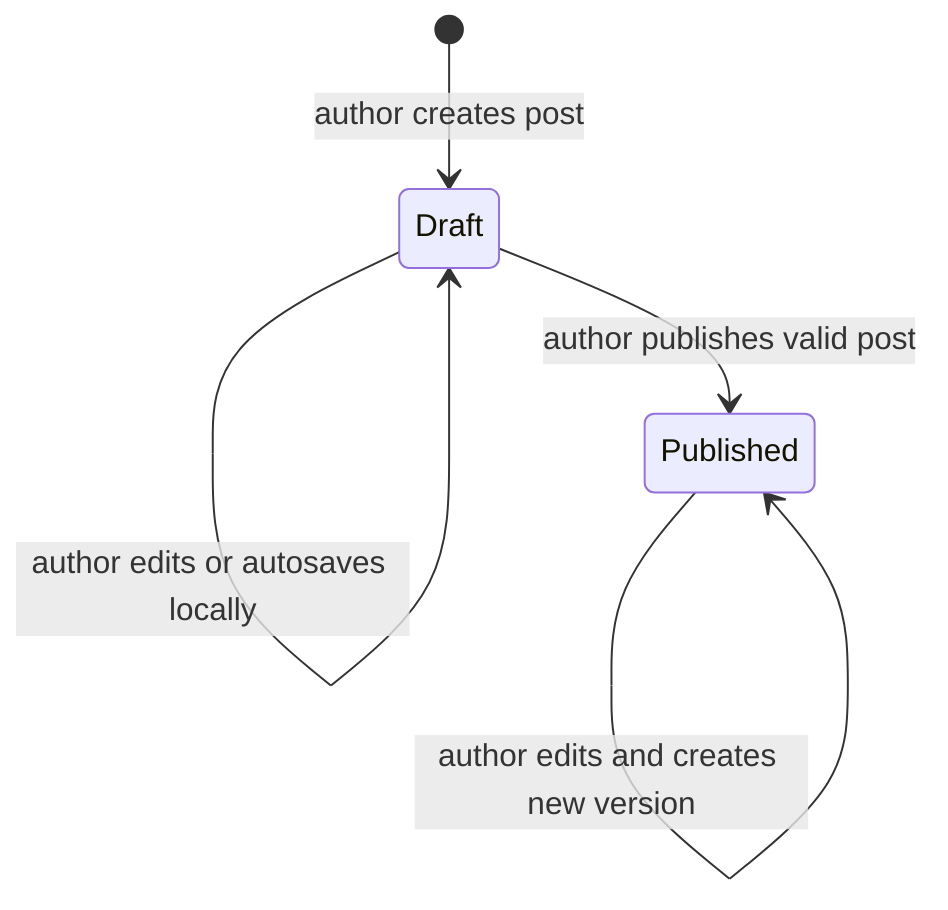

# Analysis Model

## Model Overview

---

## Scenario-Based Model

### Use Case Diagram

---

## Class-Based Model

### Domain Class Diagram

---

## Functional Model

### Feed Data Flow

### Comment Creation Boundary

Comment creation is an authenticated operation and is documented in the Workshop 4 API contract. The target post must be published before a comment can be created. The comment design remains a review point because it adds behavior around the Post state model.

---

## Behavioral Model

### Post State Diagram

The Archived state and server-persisted draft recovery are deferred and are not part of the negotiated US-03 MVP scope.

Comments are allowed only for posts in the Published state in the current design. Drafts cannot receive comments.
