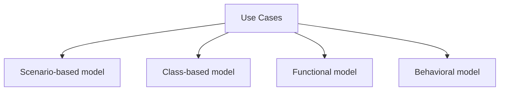
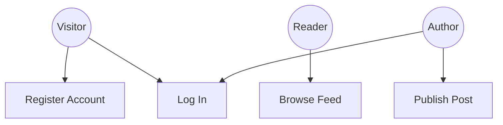
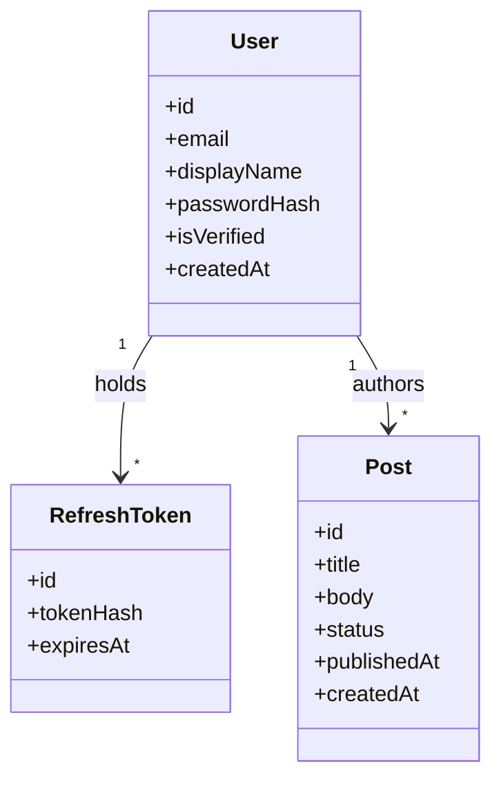
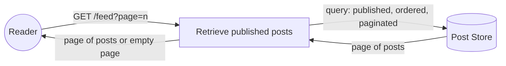
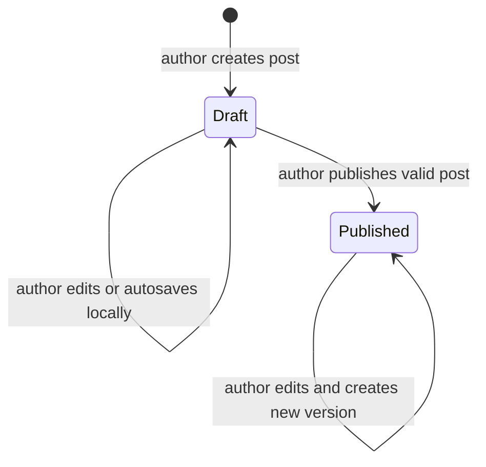

# Analysis Model

## Model Overview

---

## Scenario-Based Model

### Use Case Diagram

---

## Class-Based Model

### Domain Class Diagram

---

## Functional Model

### Feed Data Flow

---

## Behavioral Model

### Post State Diagram

The Archived state and server-persisted draft recovery are deferred and are not part of the negotiated US-03 MVP scope.
